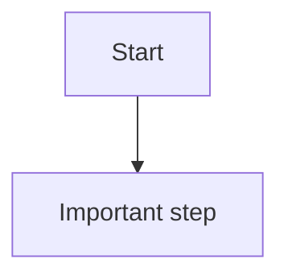

# Code-Verified Design

## Overview

Use this skill to produce design documentation that is useful to a human taking over a real project. Treat source code as the authority, but organize the writing around architecture, main system paths, data structures, runtime path/message shapes, state flow, boundaries, defects, and operational judgment.

Do not generate language-specific helper scripts as the primary deliverable unless the user explicitly asks for automation. The default deliverable is project-native documentation.

## Workflow

1. Establish scope.
   - Identify whether the user wants new docs, a rewrite of existing docs, or a targeted update.
   - If the user says old design can be ignored, do not use old docs as evidence. You may delete or supersede them if the user permits replacement.
   - Pick the project documentation location from local conventions. Prefer `docs/design/` when no stronger convention exists.

2. Build evidence from code.
   - Start with entry points, routers, lifecycle/bootstrap code, module registries, request handlers, state stores, background workers, and integration boundaries.
   - Use fast search (`rg`, `rg --files`) to locate call paths, interfaces, event names, resource names, and tests.
   - Prefer direct source references over guesses. If behavior is inferred across files, label it as an inference in the docs.

3. Derive the human reading structure.
   - Start with one global architecture document that explains the system's high-level model and the ideas a maintainer needs before reading details.
   - Then split by major end-to-end paths or conceptual threads, not by source-file dependency or package layout.
   - Each major path should normally become one Markdown file.
   - Exclude unused, historical, or non-core resources unless they affect the main design.
   - Keep an index file that explains the reading order and links every path file.

4. Write each design file as a maintainer guide.
   - Purpose and mental model: what problem this path solves and how to think about it.
   - Basic data structures: the resource schemas, message shapes, runtime objects, relation cardinality, owner fields, state names, and path shapes a human must know before reading code.
   - Main flow: the end-to-end behavior in project terms, with diagrams for complex paths.
   - State flow: how the important objects move between states, including retry, failover, ownership, projection, or lifecycle transitions.
   - Ownership model: which node/process owns each object and which nodes only hold synchronized views.
   - Boundaries: what belongs to this path and what does not.
   - Known defects / limitations: current weaknesses, race windows, operational risks, or incomplete areas observed in code.
   - Notes / gotchas: details maintainers must remember when changing or debugging the path.
   - Troubleshooting entry points: short code references only as evidence and debugging handles.

5. Keep code references subordinate.
   - Do not make the design a code index or "file X does Y" inventory.
   - Mention source files only to support a claim or give a debugging entry point.
   - Avoid documenting empty dependency declarations, trivial bootstrapping facts, or unused resources unless they explain an architectural decision.

6. Add diagrams for complex behavior.
   - Use Mermaid in Markdown unless the project has a stronger diagram convention.
   - Use `flowchart` for branching logic, lifecycle, ownership, and state transitions.
   - Use `sequenceDiagram` for request/response, async callback, queue, retry, or cross-service flows.
   - Keep diagrams small enough to be reviewed. Prefer several focused diagrams over one giant diagram.

7. Remove stale or conflicting design artifacts when appropriate.
   - If replacing design docs, update the index and remove old entry points that would mislead readers.
   - Preserve unrelated user changes.
   - Do not delete old files unless the user asked for replacement or explicitly allowed old design to be discarded.

8. Verify the documentation.
   - Check that every linked design file exists.
   - Search for stale terms, placeholder markers, and references to deleted docs.
   - Spot-check that important source paths mentioned in the docs exist.
   - Confirm diagrams are fenced as Mermaid.
   - For docs-only work, say that code tests were not run and explain why.

## Output Shape

Prefer this directory shape for medium or large systems:

```text
docs/design/
  README.md
  architecture.md
  <capability-one>.md
  <capability-two>.md
  <capability-three>.md
```

`README.md` should contain:

- A short statement that docs are code-verified.
- A global architecture overview or a link to one.
- The core mental models needed before reading details.
- A reading order for major system paths.
- A suggested reading order.

Path files should read like design narratives, not source maps. Put source paths near the end in troubleshooting or evidence sections.

For stateful or distributed systems, path files should normally include:

- A table of core resource/message/runtime structures and their important fields.
- Runtime path, topic, key, stream, or queue name shapes when identity or ownership is encoded in names.
- Relationship cardinality such as broker -> clients, queue -> clients, topic -> queues.
- A state-transition table or diagram for lifecycle-heavy behavior.
- A clear split between desired state, synchronized metadata, and local runtime projection.

## Capability File Template

````markdown
# Capability Name

## 1. Purpose

## 2. Mental Model

## 3. Core Data Structures

| Object | Important Fields | Meaning |
| --- | --- | --- |

## 4. Runtime Path / Message Shapes

```text
resource/path/<owner>/<id>
message:
  field: meaning
```

## 5. Main Flow



## 6. State Flow / Ownership Model

## 7. Boundaries

## 8. Known Defects / Limitations

## 9. Notes and Gotchas

## 10. Troubleshooting Entry Points
````

Adjust section names to match project conventions. Do not force every section when it adds no value.

## Quality Bar

Good code-verified design documentation:

- Can be used by a maintainer without reading the entire codebase first.
- Tells readers where each claim comes from.
- Separates current behavior from proposed improvements.
- Uses project concepts, not generic architecture buzzwords.
- Starts from high-level architecture, then follows the main system paths.
- Explains basic data structures and runtime path/message shapes before diving into flow details.
- Shows how objects change state and where ownership moves between desired state, sync layer, and runtime.
- Describes boundaries, known defects, and operational gotchas for every significant path.
- Avoids script-like generated output and language-specific assumptions.
- Makes complex async, distributed, retry, locking, or ownership behavior visible with diagrams.

Reject or revise docs that:

- Summarize old docs instead of checking code.
- Create one huge design file for unrelated features.
- Read like a source-file index or dependency map.
- Lead with package names instead of system concepts.
- Omit the core data structures, identity/path formats, or state transitions for a stateful feature.
- Enumerate unused resources or dead code as if they were part of the active design.
- Use diagrams as decoration rather than explanation.
- Omit source entry points.
- Hide uncertainty or inferred behavior.
- Leave stale links, placeholder markers, or conflicting old design entry points.
